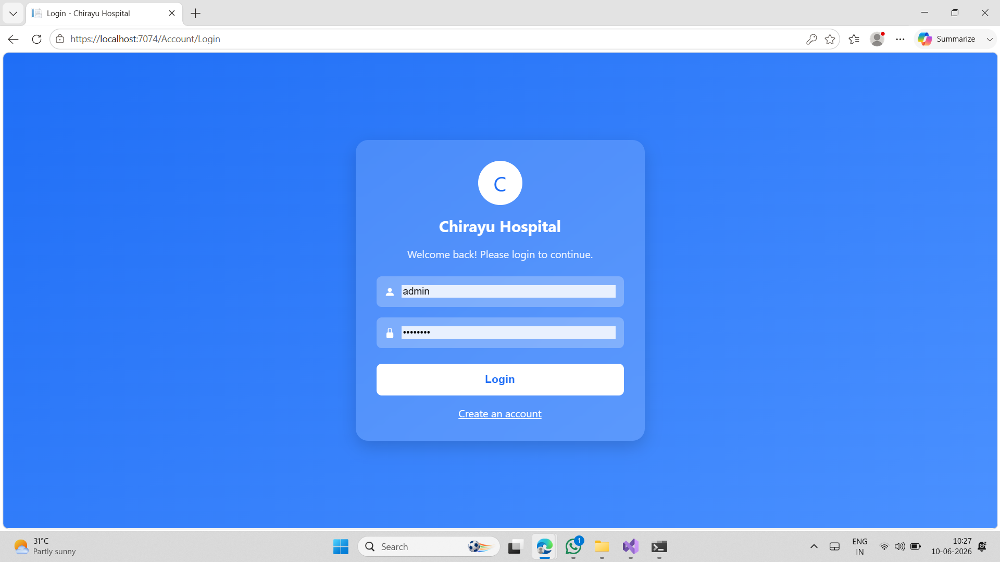
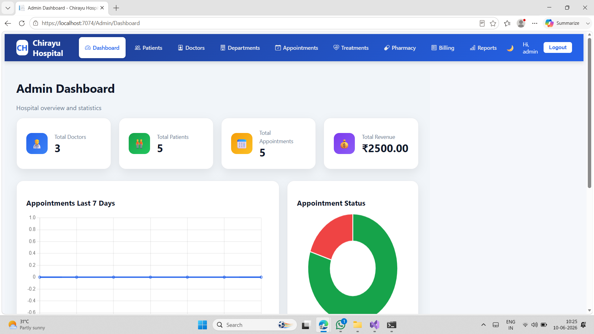
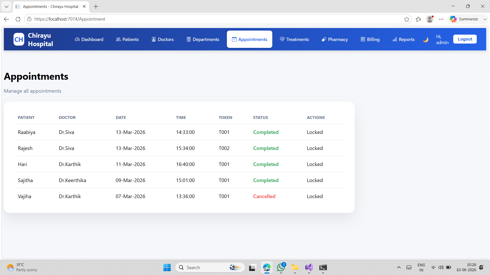
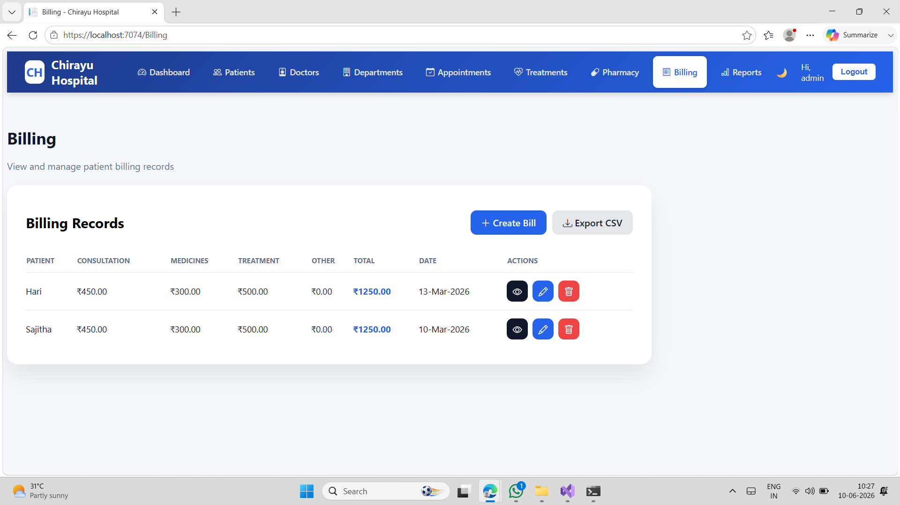
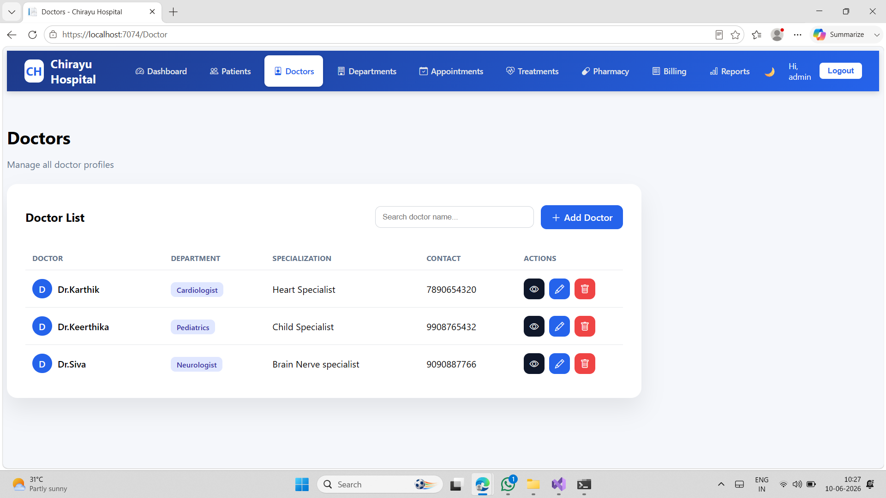
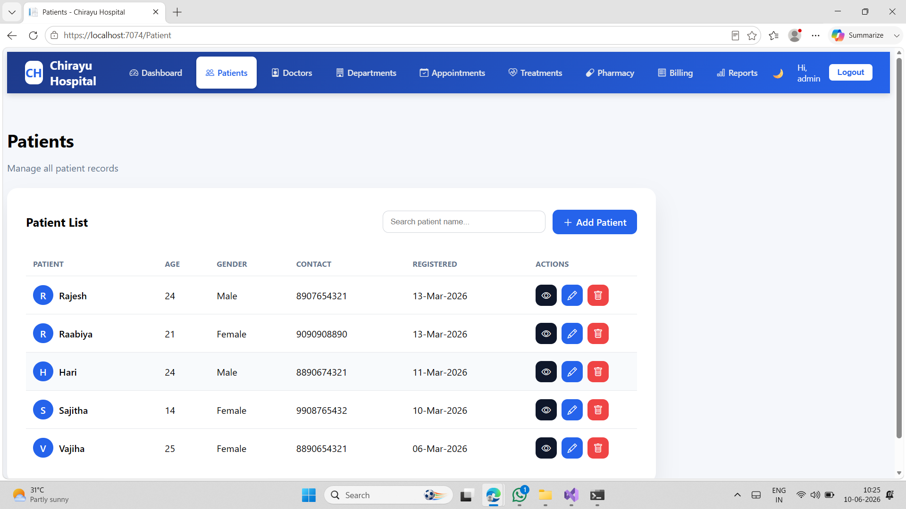
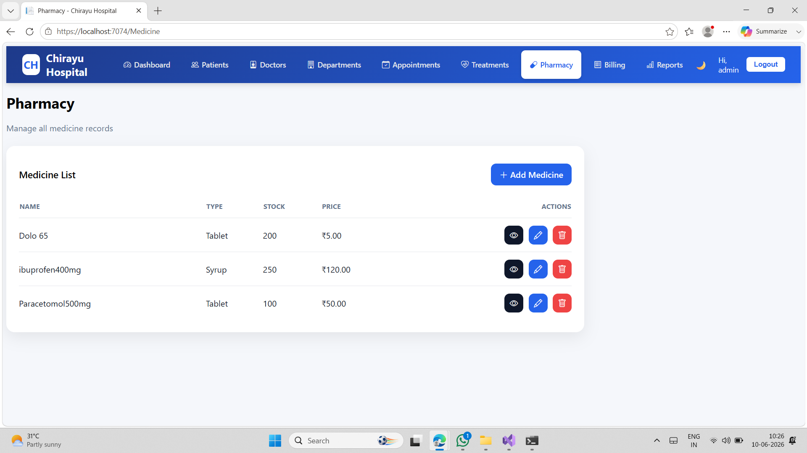
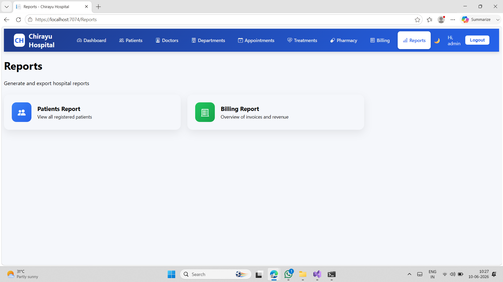

# Hospital Management System

## Project Description

Hospital Management System is a web-based application developed to manage hospital operations efficiently including patient records, appointments, billing, pharmacy, and reports.

## Features

* Patient Management
* Doctor Management
* Appointment Booking
* Billing System
* Pharmacy Management
* Reports Generation

## Technologies Used

* ASP.NET MVC
* C#
* SQL Server
* HTML
* CSS
* JavaScript

## Screenshots

### Login Page

### Dashboard

### Appointment Module

### Billing Module

### Doctors Module

### Patient Module

### Pharmacy Module

### Reports Module

## Developed By

Sajitha Fathima

